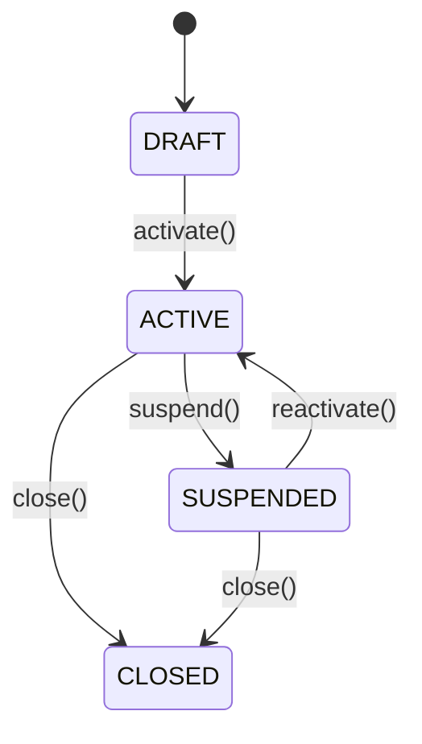
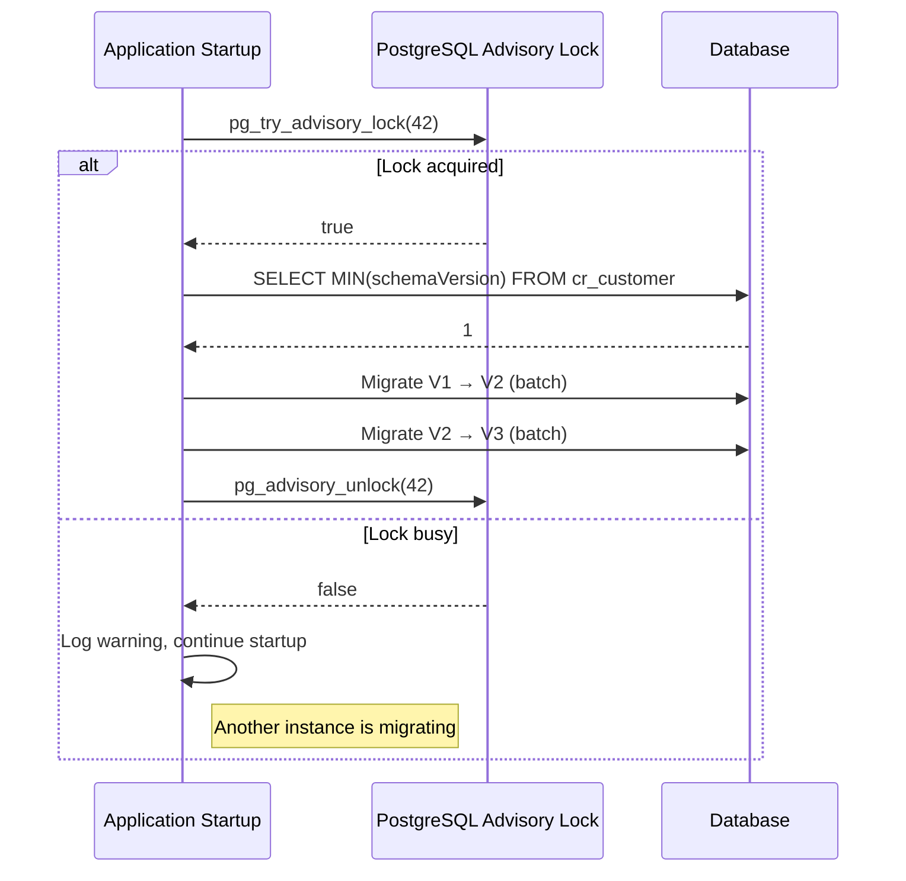
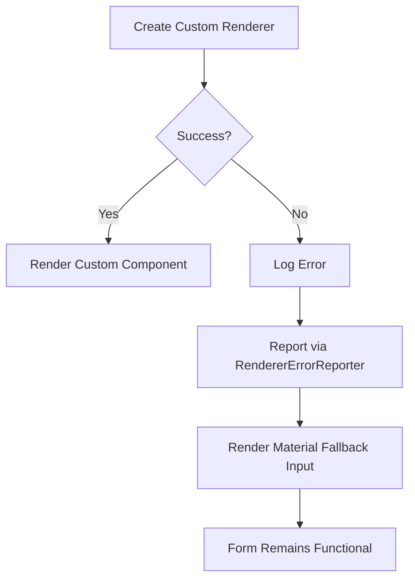
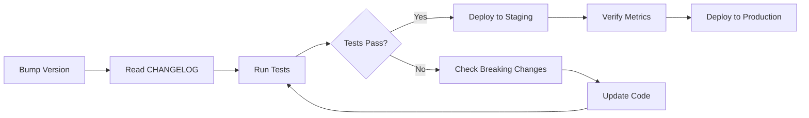

# Customer Registry

A reusable **Spring Boot Starter** (backend) + **Angular Library** (frontend) for managing Brazilian customer records (PF/PJ with CPF/CNPJ validation). Install it, configure feature flags, and extend via SPIs — zero fork required.

```
com.oneff:customer-registry-starter   (Maven)
@1ff/customer-registry-ui             (npm)
```

---

## Table of Contents

1. [AI Context](#ai-context)
2. [Quickstart](#quickstart)
3. [Feature Flags](#feature-flags)
4. [Architecture](#architecture)
5. [Domain Model](#domain-model)
6. [Extension Without Fork](#extension-without-fork)
7. [REST API](#rest-api)
8. [Events](#events)
9. [Persistence & Migrations](#persistence--migrations)
10. [JSONB Attribute Evolution](#jsonb-attribute-evolution)
11. [Observability](#observability)
12. [Frontend Library](#frontend-library)
13. [UI Graceful Degradation](#ui-graceful-degradation)
14. [Security](#security)
15. [Versioning & Upgrade Guide](#versioning--upgrade-guide)
16. [Development](#development)

---

## AI Context

```yaml
# For AI assistants working with this codebase:
project: customer-registry
type: spring-boot-starter + angular-library
language: java-21, typescript-5.4
frameworks: spring-boot-3.5, spring-modulith-1.4, angular-17
build: maven (java), ng-packagr (angular), docker-only
testing: junit5, testcontainers, archunit, jest, jest-preset-angular
ci: azure-devops
conventions:
  - TDD (red-green-refactor)
  - Docker-only builds (never run Java/Node locally)
  - Feature flags for all optional behaviors
  - @ConditionalOnMissingBean for all beans (host can override)
  - Standalone Angular components with OnPush
  - Signal-based state management
```

---

## Quickstart

### Backend

Add the starter dependency:

```xml
<dependency>
    <groupId>com.oneff</groupId>
    <artifactId>customer-registry-starter</artifactId>
    <version>0.1.0</version>
</dependency>
```

Enable in `application.yml`:

```yaml
customer:
  registry:
    enabled: true
    features:
      rest-api: true
      publish-events: true
```

### Frontend

Install the library:

```bash
npm install @1ff/customer-registry-ui
```

Configure in `app.config.ts`:

```typescript
import { provideCustomerRegistry } from '@1ff/customer-registry-ui';

export const appConfig: ApplicationConfig = {
  providers: [
    provideHttpClient(),
    provideAnimations(),
    provideCustomerRegistry({
      config: {
        apiBaseUrl: '/api/v1',
        locale: 'pt-BR',
        features: { search: true, list: true, form: true },
      },
    }),
  ],
};
```

Use components in your templates:

```html
<crui-customer-form (submitForm)="onSubmit($event)"></crui-customer-form>
<crui-customer-search (search)="onSearch($event)"></crui-customer-search>
<crui-customer-list [customers]="customers()"></crui-customer-list>
```

---

## Feature Flags

All features are **off by default** (secure-by-default). Enable only what you need.

### Backend

| Property | Default | Description |
|----------|---------|-------------|
| `customer.registry.enabled` | `false` | Master switch — nothing registers when false |
| `customer.registry.features.rest-api` | `false` | REST endpoints at `/api/v1/customers` |
| `customer.registry.features.publish-events` | `false` | Domain event publishing via Spring ApplicationEvent |
| `customer.registry.features.persistence-jpa` | `false` | JPA adapter (replaces in-memory fallback) |
| `customer.registry.features.migrations` | `false` | Liquibase schema migrations |

### Frontend

| Config Key | Default | Description |
|------------|---------|-------------|
| `features.search` | `false` | Show search/filter component |
| `features.list` | `false` | Show customer list with pagination |
| `features.details` | `false` | Show customer detail view |
| `features.form` | `false` | Show create/edit form |

---

## Architecture

```
┌─────────────────────────────────────────────────────────┐
│                    Host Application                      │
│  ┌─────────────┐  ┌──────────────┐  ┌───────────────┐  │
│  │ Custom       │  │ Custom       │  │ Custom        │  │
│  │ Validators   │  │ Enrichers    │  │ Event         │  │
│  │ (SPI)        │  │ (SPI)        │  │ Listeners     │  │
│  └──────┬───────┘  └──────┬───────┘  └───────────────┘  │
├─────────┼──────────────────┼────────────────────────────┤
│         ▼                  ▼      Customer Registry     │
│  ┌────────────────────────────────────────┐  Starter    │
│  │         CustomerRegistryService        │             │
│  │  validate → dedup → enrich → persist   │             │
│  └────────┬──────────────────────┬────────┘             │
│           ▼                      ▼                      │
│  ┌────────────────┐    ┌─────────────────┐              │
│  │ CustomerRepo   │    │ EventPublisher  │              │
│  │ (Port)         │    │ (Port)          │              │
│  └────────┬───────┘    └────────┬────────┘              │
│           ▼                     ▼                       │
│  ┌────────────────┐    ┌─────────────────┐              │
│  │ JPA Adapter    │    │ Spring Events   │              │
│  │ (or InMemory)  │    │ Adapter         │              │
│  └────────────────┘    └─────────────────┘              │
└─────────────────────────────────────────────────────────┘
```

The starter uses **Spring Modulith** for internal module boundaries:
- `core` — domain model, ports, SPIs, service (always loaded)
- `persistence` — JPA adapter (when `persistence-jpa=true`)
- `rest` — REST controller (when `rest-api=true`)
- `events` — event publishing adapter (when `publish-events=true`)
- `observability` — metrics and spans (when Micrometer on classpath)
- `autoconfigure` — `@ConditionalOnProperty` wiring

---

## Domain Model

```
Customer (aggregate root)
├── id: UUID
├── type: CustomerType (PF | PJ)
├── document: Document (CPF or CNPJ with checksum validation)
├── displayName: String
├── status: CustomerStatus (DRAFT → ACTIVE → SUSPENDED → CLOSED)
├── addresses: List<Address>
├── contacts: List<Contact>
├── attributes: Attributes (typed map with schemaVersion)
├── createdAt / updatedAt: Instant
```

### Status Transitions



### Attributes (Typed, Extensible)

```java
// Sealed hierarchy — type-safe, pattern-matchable
sealed interface AttributeValue permits StringValue, IntegerValue,
    BooleanValue, DecimalValue, DateValue {}

// Usage
customer.getAttributes().with("loyaltyTier", new StringValue("GOLD"));
StringValue tier = customer.getAttributes().get("loyaltyTier", StringValue.class);
```

Attributes are stored as PostgreSQL JSONB with a `schemaVersion` for forward-compatible evolution.

---

## Extension Without Fork

### Backend: Custom Validator

```java
@Component
public class MinimumAgeValidator implements CustomerValidator {
    @Override
    public ValidationResult validate(Customer customer) {
        if (customer.getType() == CustomerType.PF
                && customer.getDisplayName().length() < 3) {
            return ValidationResult.invalid("validation.name.tooShort");
        }
        return ValidationResult.valid();
    }
}
```

### Backend: Custom Enricher

```java
@Component
public class LoyaltyEnricher implements CustomerEnricher {
    @Override
    public Customer enrich(Customer customer) {
        if (!customer.getAttributes().containsKey("loyaltyTier")) {
            customer.setAttributes(
                customer.getAttributes().with("loyaltyTier", new StringValue("BRONZE"))
            );
        }
        return customer;
    }
}
```

### Backend: Event Listener

```java
@Component
public class CustomerEventLogger {
    @EventListener
    public void onCreated(CustomerCreated event) {
        log.info("Customer created: {}", event.customerId());
    }
}
```

### Frontend: Extra Fields + Custom Renderer

```typescript
provideCustomerRegistry({
  config: { apiBaseUrl: '/api/v1' },
  extraFields: [
    {
      key: 'loyaltyNumber',
      labelKey: 'field.loyaltyNumber',
      type: 'custom',
      rendererId: 'loyalty-renderer',
    },
  ],
  fieldRenderers: [
    { rendererId: 'loyalty-renderer', component: LoyaltyRendererComponent },
  ],
  i18nOverrides: {
    'pt-BR': { 'field.loyaltyNumber': 'Numero de Fidelidade' },
    en: { 'field.loyaltyNumber': 'Loyalty Number' },
  },
})
```

### Frontend: i18n Overrides

The library ships with `pt-BR` and `en` translations. Override any key:

```typescript
provideCustomerRegistry({
  i18nOverrides: {
    'pt-BR': {
      'label.create': 'Cadastrar Cliente',
      'validation.cpf.invalid': 'CPF invalido, verifique os digitos',
    },
  },
})
```

Fallback chain: host overrides → built-in[locale] → built-in['en'] → key.

---

## REST API

Enabled with `customer.registry.features.rest-api=true`.

| Method | Endpoint | Description |
|--------|----------|-------------|
| `POST` | `/api/v1/customers` | Create customer |
| `GET` | `/api/v1/customers/{id}` | Get by ID |
| `GET` | `/api/v1/customers/by-document/{doc}` | Get by document |
| `PATCH` | `/api/v1/customers/{id}` | Update customer |
| `DELETE` | `/api/v1/customers/{id}` | Delete customer |

Errors use **RFC 7807 ProblemDetails** with `Accept-Language` locale resolution:

```json
{
  "type": "urn:customer-registry:validation-error",
  "title": "Validation Failed",
  "status": 400,
  "detail": "CPF invalido",
  "instance": "/api/v1/customers"
}
```

---

## Events

Enabled with `customer.registry.features.publish-events=true`.

Domain events are published via Spring's `ApplicationEventPublisher`:

| Event | Fields |
|-------|--------|
| `CustomerCreated` | `customerId`, `document`, `type`, `eventId` |
| `CustomerUpdated` | `customerId`, `eventId` |
| `CustomerStatusChanged` | `customerId`, `fromStatus`, `toStatus`, `eventId` |

Each event carries a deterministic `eventId` (UUID v5) for idempotency.

Listen in your host app:

```java
@EventListener
public void handle(CustomerCreated event) {
    // React to customer creation
}
```

---

## Persistence & Migrations

### JPA (when `persistence-jpa=true`)

Tables are prefixed `cr_` to avoid collisions with host app tables:
- `cr_customer` — main customer table
- `cr_address` — customer addresses
- `cr_contact` — customer contacts

### Liquibase (when `migrations=true`)

Changelogs use formatted SQL with versioned directories:

```
resources/db/changelog/
├── customer-registry-changelog-master.yaml
├── v1.0.0/001-create-customer-tables.sql
├── v1.1.0/001-add-attributes-jsonb.sql
└── v1.2.0/001-add-contact-type-column.sql
```

Key properties:
- Separate tracking tables: `cr_databasechangelog`, `cr_databasechangeloglock`
- Every changeSet has `preconditions onFail:MARK_RAN` + `IF NOT EXISTS` for idempotency
- Host apps can add their own changeSets — they run alongside the starter's

### Host App Custom Migrations

Add your own Liquibase changelogs that extend the `cr_customer` schema:

```sql
-- db/changelog/custom/001-add-loyalty-tier.sql
--changeset example:add-loyalty-tier
--preconditions onFail:MARK_RAN
ALTER TABLE cr_customer ADD COLUMN IF NOT EXISTS loyalty_tier VARCHAR(20);
```

---

## JSONB Attribute Evolution

Attributes are stored as PostgreSQL JSONB with a `schemaVersion` field. The starter supports automatic schema migration.

### Schema Versions

| Version | Changes |
|---------|---------|
| V1 | Initial: string-only attributes |
| V2 | Added typed values (Integer, Boolean, Decimal, Date) |
| V3 | Added nested attribute groups |

### Migration Behavior



Unknown keys in JSONB are always preserved during migration.

---

## Observability

Metrics are registered automatically when Micrometer is on the classpath.

### Metrics

| Metric | Type | Labels | Description |
|--------|------|--------|-------------|
| `customer_registry_operations_total` | Counter | `operation`, `status` | CRUD operation count |
| `customer_registry_operation_duration_seconds` | Timer | `operation` | Operation duration |
| `customer_registry_schema_version_count` | Gauge | `version` | Customers per schema version |
| `customer_registry_schema_migration_total` | Counter | `from`, `to`, `status` | Migration executions |
| `customer_registry_schema_migration_duration_seconds` | Timer | `from`, `to` | Migration duration |
| `customer_registry_schema_migration_lock_contention_total` | Counter | — | Lock contention events |

### Prometheus Queries

```promql
# Operation success rate (last 5 minutes)
sum(rate(customer_registry_operations_total{status="success"}[5m]))
/ sum(rate(customer_registry_operations_total[5m]))

# P99 create duration
histogram_quantile(0.99,
  rate(customer_registry_operation_duration_seconds_bucket{operation="create"}[5m]))

# Schema version distribution
customer_registry_schema_version_count
```

### Alert Examples

```yaml
# High error rate
- alert: CustomerRegistryHighErrorRate
  expr: |
    sum(rate(customer_registry_operations_total{status="failure"}[5m]))
    / sum(rate(customer_registry_operations_total[5m])) > 0.05
  for: 5m
  labels:
    severity: warning

# Migration lock contention
- alert: CustomerRegistrySchemaMigrationContention
  expr: increase(customer_registry_schema_migration_lock_contention_total[1h]) > 5
  labels:
    severity: info
```

---

## Frontend Library

### Components

| Component | Selector | Key Features |
|-----------|----------|-------------|
| `CustomerFormComponent` | `crui-customer-form` | PF/PJ toggle, CPF/CNPJ validation, extra fields via tokens |
| `CustomerListComponent` | `crui-customer-list` | MatTable with pagination, sort, status badges |
| `CustomerSearchComponent` | `crui-customer-search` | Filter by type, status, document, name |
| `CustomerDetailsComponent` | `crui-customer-details` | Read-only card view |
| `SafeFieldRendererHostComponent` | `crui-safe-field-renderer` | Dynamic renderer with graceful degradation |

All components are **Standalone** with `ChangeDetectionStrategy.OnPush`.

### Signal-Based State

```typescript
// CustomerStateService signals
customers: Signal<Customer[]>
selectedCustomer: Signal<Customer | null>
loading: Signal<boolean>
error: Signal<string | null>
totalCount: Signal<number>
isEmpty: Signal<boolean>
```

### InjectionTokens

| Token | Type | Multi? | Purpose |
|-------|------|--------|---------|
| `CUSTOMER_REGISTRY_UI_CONFIG` | `CustomerRegistryUiConfig` | No | Main config |
| `CUSTOMER_EXTRA_FIELDS` | `ExtraFieldDefinition[]` | Yes | Add fields to form |
| `CUSTOMER_VALIDATION_RULES` | `CustomerValidationRule[]` | Yes | Add validators |
| `CUSTOMER_FIELD_RENDERERS` | `FieldRendererRegistration[]` | Yes | Custom renderers |
| `CUSTOMER_I18N_OVERRIDES` | `Record<string, Record<string, string>>` | No | i18n overrides |
| `CUSTOMER_UI_RENDERER_ERROR_REPORTER` | `RendererErrorReporter` | No | Error tracking |

### Theming

Override CSS custom properties in your host app:

```css
:root {
  --crui-primary: #6200ea;
  --crui-spacing-md: 20px;
  --crui-status-active-bg: #e8f5e9;
}
```

---

## UI Graceful Degradation

Custom field renderers run inside `SafeFieldRendererHostComponent`, which wraps `ViewContainerRef.createComponent()` in a try/catch:



If a custom renderer throws during creation or change detection:
1. `ErrorHandler.handleError(error)` is called
2. `RendererErrorReporter.report(rendererId, error)` is called
3. A standard Material text input is shown as fallback
4. The form control remains connected — the form still submits

This prevents a buggy extension from breaking the entire customer form.

---

## Security

### CI/CD Security Gates

| Tool | What it checks | Threshold |
|------|----------------|-----------|
| SpotBugs + FindSecBugs | Java SAST (bugs, security) | Medium severity |
| Semgrep | Pattern-based SAST | WARNING severity |
| OWASP Dependency-Check | Known CVEs in Java dependencies | CVSS >= 7 |
| npm audit | Known CVEs in npm dependencies | High severity |
| CycloneDX | SBOM generation (Java + Angular) | — |

### Suppression Workflow

1. CVE found → create entry in `.azure/security/SECURITY_APPROVAL.md`
2. Document justification, mitigating controls, remediation plan
3. Get sign-off from security lead + tech lead
4. Add suppression to `owasp-suppressions.xml` with reference to approval
5. Set review date (max 90 days)

### Design Principles

- **Secure by default**: all features are off until explicitly enabled
- **No hardcoded credentials**: use env vars or secrets managers
- **Table prefixing**: `cr_` prefix avoids collision with host app tables
- **Input validation**: CPF/CNPJ checksum validation, document format stripping
- **No high-cardinality labels**: metrics never include customer IDs or documents

---

## Versioning & Upgrade Guide

### SemVer Policy

| Change Type | Version Bump | Examples |
|-------------|-------------|---------|
| New feature (backward-compatible) | Minor | New SPI, new metric, new component |
| Bug fix | Patch | Fix validation logic, fix event publishing |
| Breaking change | Major | Remove deprecated API, change event schema |
| Deprecation | Minor | Mark method `@Deprecated`, log warning |

Deprecation timeline: deprecated in version N, removed in version N+2 (minimum).

### Upgrade Checklist

When upgrading the Customer Registry starter/library:

- [ ] Read CHANGELOG.md for breaking changes
- [ ] Check deprecated API warnings in build output
- [ ] If JSONB schema version changed: verify `AttributeMigrationService` runs on startup
- [ ] If REST API changed: update API clients / OpenAPI consumers
- [ ] If Angular components changed: verify custom renderers still compile
- [ ] If new feature flags added: review defaults in your `application.yml`
- [ ] Run full test suite: `make verify`
- [ ] Verify metrics: check Prometheus for `customer_registry_schema_version_count`

### Upgrade Flow



---

## Development

### Prerequisites

- Docker and Docker Compose
- Make

All builds run inside Docker. **Never run Java or Node locally.**

### Commands

```bash
# Build everything
make build

# Run all tests
make test

# Full verification (includes ArchUnit)
make verify

# Start Postgres + pgAdmin
make up

# Stop services
make down

# Security scan
make security-scan
```

### Project Structure

```
1ff/
├── pom.xml                              # Maven reactor POM
├── customer-registry-bom/               # BOM (dependency versions)
├── customer-registry-starter/           # Spring Boot Starter
│   └── src/main/java/com/oneff/customer/
│       ├── core/                        # Domain (model, port, spi, service)
│       ├── persistence/                 # JPA adapter
│       ├── rest/                        # REST controller
│       ├── events/                      # Event publishing
│       ├── observability/               # Metrics & spans
│       └── autoconfigure/              # @ConditionalOnProperty wiring
├── customer-registry-client-example-backend/  # Backend example app
├── frontend/                            # Angular workspace
│   ├── projects/customer-registry-ui/   # Angular library
│   └── projects/example-crm-app/        # Frontend example app
├── docker/                              # Dockerfiles + compose
├── .azure/                              # CI/CD pipelines + security
├── Makefile                             # Docker-wrapped commands
└── VERSION                              # SemVer source of truth
```

### Test Counts

| Module | Tests | Framework |
|--------|-------|-----------|
| Starter (domain + service) | 137 | JUnit 5 + Testcontainers |
| Backend Example | 6 | JUnit 5 |
| Angular Library | 96 | Jest |
| Frontend Example | 21 | Jest |
| **Total** | **260** | |

### Branch Strategy

- `main` — protected, requires PR with passing pipeline
- `feature/*` — feature branches per phase
- Tags `v*` — trigger release pipeline
